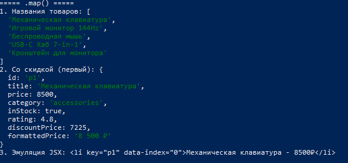
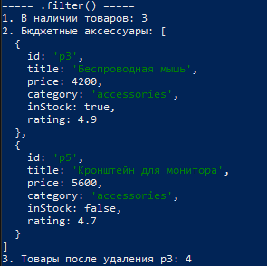
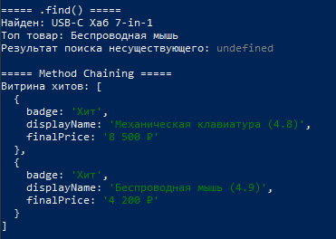
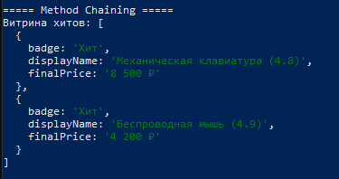
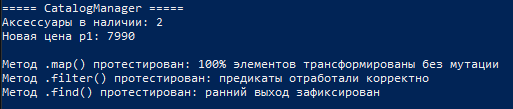
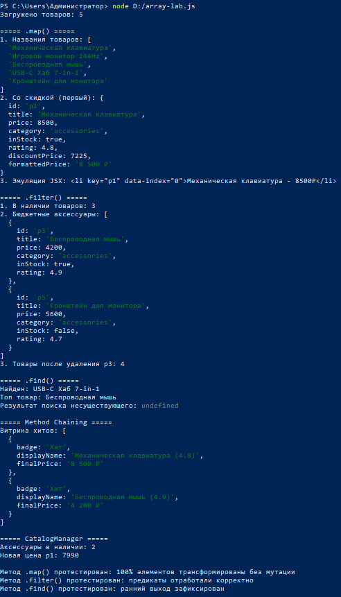

# Практическая работа №4  
## Массивы и методы высшего порядка: `map`, `filter`, `find`

**Студент:** [Укажи ФИО]  
**Группа:** [Укажи группу]  
**Дата:** 25.09.2026  

---

## 1. Цель работы

Отработать основные методы массивов JavaScript (`map`, `filter`, `find`) и научиться применять их для типичных задач React-разработки: трансформация данных, фильтрация каталога, поиск элементов и построение цепочек обработки (method chaining).

---

## 2. Исходные данные

Для выполнения работы использовался массив товаров интернет-магазина:

```js
const products = [
  { id: "p1", title: "Механическая клавиатура", price: 8500,  category: "accessories", inStock: true,  rating: 4.8 },
  { id: "p2", title: "Игровой монитор 144Hz",   price: 24000, category: "displays",    inStock: false, rating: 4.6 },
  { id: "p3", title: "Беспроводная мышь",       price: 4200,  category: "accessories", inStock: true,  rating: 4.9 },
  { id: "p4", title: "USB-C Хаб 7-in-1",        price: 3100,  category: "adapters",    inStock: true,  rating: 4.2 },
  { id: "p5", title: "Кронштейн для монитора",  price: 5600,  category: "accessories", inStock: false, rating: 4.7 },
];
```

---

## 3. Выполнение заданий

### 3.1. Метод `.map()` — трансформация данных

**Задачи:**
1. Получить массив только названий товаров.
2. Добавить скидку 15% и отформатированную цену.
3. Сгенерировать эмуляцию JSX-списка (для React).

```js
// Задача 1
const productTitles = products.map(item => item.title);

// Задача 2
const productsWithDiscount = products.map(item => ({
  ...item,
  discountPrice: item.price * 0.85,
  formattedPrice: `${item.price.toLocaleString("ru-RU")} ₽`
}));

// Задача 3 — эмуляция JSX
const mockJsxList = products.map((item, index) =>
  `<li key="${item.id}" data-index="${index}">${item.title} - ${item.price}₽</li>`
);
```

**Результат выполнения:**



> **Важно:** при возврате JSX в React всегда указывайте `key={item.id}` на самом внешнем элементе.

---

### 3.2. Метод `.filter()` — выборки и удаление

**Задачи:**
1. Выбрать только товары в наличии (`inStock === true`).
2. Найти аксессуары дешевле 6000 ₽.
3. Удалить товар по ID (паттерн `handleDelete` в React).

```js
// Задача 1
const inStockOnly = products.filter(item => item.inStock);

// Задача 2
const affordableAccessories = products.filter(
  item => item.category === "accessories" && item.price < 6000
);

// Задача 3
const idToDelete = "p3";
const remainingProducts = products.filter(item => item.id !== idToDelete);
```

**Результат выполнения:**



---

### 3.3. Метод `.find()` — поиск элемента

**Задачи:**
1. Найти товар по точному ID.
2. Найти первый товар с рейтингом ≥ 4.9.
3. Обработать случай, когда элемент не найден (`undefined`).

```js
// Задача 1
const targetId = "p4";
const foundProduct = products.find(item => item.id === targetId);
console.log(`Найден: ${foundProduct?.title ?? "Товар не найден"}`);

// Задача 2
const topRated = products.find(item => item.rating >= 4.9);

// Задача 3
const missing = products.find(item => item.id === "p999");
```

**Результат выполнения:**



---

### 3.4. Method Chaining — витрина «Хиты продаж»

Объединение `filter` + `map` в одну цепочку:

```js
const showcaseProducts = products
  .filter(item => item.inStock && item.rating >= 4.5)
  .map(item => ({
    badge: "★ Хит",
    displayName: `${item.title} (${item.rating})`,
    finalPrice: `${item.price.toLocaleString("ru-RU")} ₽`
  }));
```

**Результат выполнения:**



---

### 3.5. Итоговый модуль CatalogManager

Реализованы три функции бизнес-логики:

```js
// 1. Поиск по ID
const getProductById = (list, id) =>
  list.find(item => item.id === id);

// 2. Фильтрация каталога
const filterCatalog = (list, { category, onlyInStock = false } = {}) => {
  return list.filter(item => {
    const matchesCategory = category ? item.category === category : true;
    const matchesStock = onlyInStock ? item.inStock : true;
    return matchesCategory && matchesStock;
  });
};

// 3. Изменение цены через .map()
const updateProductPrice = (list, id, newPrice) => {
  return list.map(item =>
    item.id === id ? { ...item, price: newPrice } : item
  );
};
```

**Проверка работы:**

```js
const activeAccessories = filterCatalog(products, {
  category: "accessories",
  onlyInStock: true
});

const updatedList = updateProductPrice(products, "p1", 7990);

console.log("Аксессуары в наличии:", activeAccessories.length); // 2
console.log("Новая цена p1:", getProductById(updatedList, "p1")?.price); // 7990
```

**Результат выполнения:**



---

## 4. Полный вывод консоли



```
Загружено товаров: 5

===== .map() =====
1. Названия товаров: [ ... ]
2. Со скидкой (первый): { ... discountPrice: 7225 ... }
3. Эмуляция JSX: <li key="p1" ...>

===== .filter() =====
1. В наличии товаров: 3
2. Бюджетные аксессуары: [ мышь, кронштейн ]
3. Товары после удаления p3: 4

===== .find() =====
Найден: USB-C Хаб 7-in-1
Топ товар: Беспроводная мышь
Результат поиска несуществующего: undefined

===== Method Chaining =====
Витрина хитов: [ 2 товара ]

===== CatalogManager =====
Аксессуары в наличии: 2
Новая цена p1: 7990

✓ Метод .map() протестирован: 100% элементов трансформированы без мутации
✓ Метод .filter() протестирован: предикаты отработали корректно
✓ Метод .find() протестирован: ранний выход зафиксирован
```

---

## 5. Выводы

В ходе практической работы были успешно отработаны:

- **`.map()`** — создание нового массива той же длины (проекция данных, генерация JSX).
- **`.filter()`** — создание нового массива меньшей или равной длины (фильтрация и удаление).
- **`.find()`** — поиск первого совпадения с ранним выходом.
- **Method Chaining** — объединение нескольких методов в декларативный пайплайн.
- **CatalogManager** — готовый модуль бизнес-логики, который можно использовать в React-приложении.

Все методы являются **чистыми** (не мутируют исходный массив), что соответствует лучшим практикам работы с состоянием в React.

---

## 6. Исходный код

Полный исходный код лабораторной работы находится в файле [`array-lab.js`](./array-lab.js).
